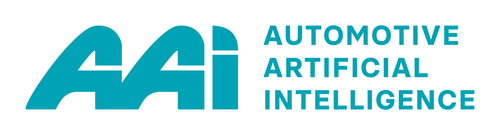

<p align="center">
  
</p>

# ⚖️ CORA: Air-Gapped Legal AI (Lite Edition)

Cora is a fully local, privacy-first legal retrieval-augmented generation (RAG) agent. It answers complex regulatory questions—EU vehicle homologation, GDPR, the AI Act—without sending your data or queries to any cloud API.

This **Open-Source Lite Edition** includes a curated dataset of 1,000 European Union directives and regulations.

---

## 🚀 Quickstart (Zero-Click Install)

Cora requires zero manual configuration. The setup scripts install Python dependencies, download the Ollama AI engine, fetch the **Qwen 2.5 (7B)** reasoning model, and launch the interface.

**macOS / Linux:**

```bash
chmod +x setup.sh
./setup.sh
```

**Windows:**  
Double-click `setup.bat` in your file explorer.

---

## 🧠 How it Works

- **Universal Query Expansion** — Cora uses Qwen 2.5 to expand acronyms (e.g. ALKS, GDPR, AEBS) and clean user queries before searching.
- **Semantic Retrieval** — Uses `all-MiniLM-L6-v2` to retrieve the top 3 most relevant legal files from the offline dataset in milliseconds.
- **Grounded Generation** — The LLM answers using only the retrieved legal texts, with strict source citations and no external hallucinations.

---

## 🏢 Enterprise Edition

The Lite Edition is a technology preview. For enterprise compliance teams, Tier-1 automotive suppliers, and law firms, **Cora Enterprise** offers:

- The full **257,000+ EU document library** (every regulation from 1952 to 2025)
- **BGE-Large** semantic engine (1.3GB, 1024-dimensional vectors)
- Cross-encoder reranking
- DGX / Apache Spark deployment pipelines

Contact us to deploy Cora Enterprise on your internal servers.

---

## 📄 License

This project is open source under the [MIT License](LICENSE).  
Copyright © Automotive Artificial Intelligence (AAI) GmbH.

---

## 💬 GitHub Discussions

Have a question, suggestion, or want to discuss something? Head over to our [GitHub Discussions](https://github.com/automotive-ai/cora-lite/discussions) page.

## 🐛 GitHub Issues

If you encounter any bugs or issues, please report them on our [GitHub Issues](https://github.com/automotive-ai/cora-lite/issues) page.

---

## 🔗 Links



- **Website:** [automotive-ai.com](https://www.automotive-ai.com) — For our complete portfolio
- **LinkedIn:** [Automotive AI](https://www.linkedin.com/company/aai-innovates) — For more updates
- **Support Email:** [support@automotive-ai.com](mailto:support@automotive-ai.com)
